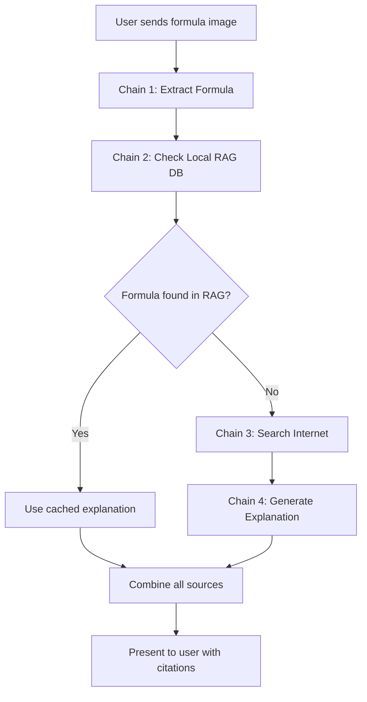

# 🏗️ Architecture Plan: External Search & RAG Integration

## 📋 Overview

This document outlines the implementation plan for adding external search functionality with RAG (Retrieval-Augmented Generation) and multi-chain processing to the Formula Recognition Bot.

## 🎯 Goals

1. **Multi-Chain Processing**: Implement 4-chain workflow for comprehensive formula analysis
2. **RAG Integration**: Local knowledge base for common formulas (fast lookup)
3. **External Search**: DuckDuckGo integration for internet-based formula information
4. **Caching**: Store search results to reduce API calls and improve performance
5. **Enhanced UX**: Combine all sources into a single, comprehensive response with citations

## 🔄 Multi-Chain Workflow



### Chain Details

#### Chain 1: Formula Extraction (Existing)
- **Input**: Image file_id from GigaChat
- **Process**: Vision model extracts formula text/LaTeX
- **Output**: Formula text string
- **Tool**: GigaChat Vision API

#### Chain 2: RAG Knowledge Base Lookup (NEW)
- **Input**: Extracted formula text
- **Process**: 
  1. Normalize formula (remove spaces, standardize notation)
  2. Search local JSON knowledge base
  3. Calculate similarity score
- **Output**: Cached formula data (if found) or None
- **Tool**: Custom FormulaKnowledgeBase service

#### Chain 3: Internet Search (NEW)
- **Input**: Formula text + formula name (if identified)
- **Process**:
  1. Build search query: "{formula} formula explanation"
  2. Search DuckDuckGo
  3. Extract relevant snippets
  4. Check cache database first
- **Output**: Search results with URLs and snippets
- **Tool**: DuckDuckGo Search API

#### Chain 4: Explanation Generation (Enhanced)
- **Input**: 
  - Formula text
  - RAG data (if available)
  - Search results (if available)
- **Process**: Enhanced prompt with all context
- **Output**: Comprehensive explanation with citations
- **Tool**: GigaChat LLM with LangChain

## 📁 New File Structure

```
ainj/
├── data/                           # NEW: Data directory
│   ├── formulas_kb.json           # RAG knowledge base
│   └── cache.db                   # Search results cache (SQLite)
├── src/
│   ├── services/
│   │   ├── gigachat_service.py    # UPDATED: Multi-chain logic
│   │   ├── formula_kb.py          # NEW: RAG service
│   │   └── search_service.py      # NEW: DuckDuckGo integration
│   ├── database/
│   │   ├── models.py              # UPDATED: Add SearchCache model
│   │   └── repository.py          # UPDATED: Add cache operations
│   ├── utils/
│   │   └── formula_utils.py       # NEW: Formula normalization
│   └── config/
│       └── settings.py            # UPDATED: Add search settings
```

## 🗄️ Data Models

### RAG Knowledge Base (JSON)

```json
{
  "formulas": [
    {
      "id": "einstein_mass_energy",
      "formula": "E = mc²",
      "normalized": "e=mc2",
      "variants": ["E=mc^2", "E = m*c^2"],
      "name": "Формула Эйнштейна",
      "category": "physics",
      "description": "Связь между массой и энергией",
      "variables": {
        "E": "Энергия (Джоули)",
        "m": "Масса (килограммы)",
        "c": "Скорость света (≈3×10⁸ м/с)"
      },
      "applications": [
        "Ядерная физика",
        "Релятивистская механика"
      ],
      "example": "Для массы 1 кг: E = 1 × (3×10⁸)² = 9×10¹⁶ Дж"
    }
  ]
}
```

### Search Cache (SQLite)

```sql
CREATE TABLE search_cache (
    id INTEGER PRIMARY KEY AUTOINCREMENT,
    formula_normalized TEXT NOT NULL,
    search_query TEXT NOT NULL,
    results TEXT NOT NULL,  -- JSON string
    created_at TIMESTAMP DEFAULT CURRENT_TIMESTAMP,
    expires_at TIMESTAMP,
    UNIQUE(formula_normalized)
);
```

## 🔧 Implementation Details

### 1. Dependencies (requirements.txt)

```python
# Existing dependencies
aiogram==3.13.1
aiosqlite==0.20.0
python-dotenv==1.0.1
gigachat==0.1.35
langchain-gigachat==0.2.2
langchain==0.3.7
pydantic==2.10.3
pydantic-settings==2.6.1

# NEW dependencies
duckduckgo-search==6.3.5
langchain-community==0.3.7
```

### 2. FormulaKnowledgeBase Service

**Purpose**: Manage local RAG knowledge base

**Key Methods**:
- `load_knowledge_base()`: Load formulas from JSON
- `search_formula(formula_text)`: Find matching formula
- `normalize_formula(formula)`: Standardize notation
- `calculate_similarity(f1, f2)`: Compare formulas
- `add_formula(formula_data)`: Add new formula to KB

**Algorithm**:
```python
def search_formula(formula_text):
    normalized = normalize_formula(formula_text)
    
    for formula in knowledge_base:
        if normalized == formula.normalized:
            return formula  # Exact match
        
        for variant in formula.variants:
            if normalized == normalize_formula(variant):
                return formula  # Variant match
    
    # Fuzzy matching with similarity threshold
    best_match = None
    best_score = 0
    
    for formula in knowledge_base:
        score = calculate_similarity(normalized, formula.normalized)
        if score > 0.8 and score > best_score:
            best_match = formula
            best_score = score
    
    return best_match
```

### 3. SearchService

**Purpose**: Handle DuckDuckGo searches with caching

**Key Methods**:
- `search_formula(formula_text, formula_name)`: Search internet
- `get_cached_results(formula)`: Check cache first
- `cache_results(formula, results)`: Store in cache
- `build_search_query(formula, name)`: Create optimal query

**Search Strategy**:
```python
async def search_formula(formula_text, formula_name=None):
    # 1. Check cache first
    cached = await get_cached_results(formula_text)
    if cached and not expired(cached):
        return cached.results
    
    # 2. Build search query
    if formula_name:
        query = f"{formula_name} formula explanation"
    else:
        query = f"{formula_text} formula what is"
    
    # 3. Search DuckDuckGo
    search = DuckDuckGoSearchResults(max_results=5)
    results = search.run(query)
    
    # 4. Cache results
    await cache_results(formula_text, results)
    
    return results
```

### 4. Enhanced GigaChatService

**Updated Method**: `recognize_formula(file_id)`

```python
async def recognize_formula(self, file_id: str) -> str:
    # Chain 1: Extract formula
    formula_text = await self._extract_formula_from_image(file_id)
    
    # Chain 2: Check RAG knowledge base
    rag_data = await self.formula_kb.search_formula(formula_text)
    
    # Chain 3: Search internet (if not in RAG or for additional context)
    search_results = None
    if not rag_data or self.config.always_search:
        formula_name = rag_data.name if rag_data else None
        search_results = await self.search_service.search_formula(
            formula_text, 
            formula_name
        )
    
    # Chain 4: Generate comprehensive explanation
    explanation = await self._explain_formula_with_context(
        formula_text=formula_text,
        rag_data=rag_data,
        search_results=search_results
    )
    
    return explanation
```

**New Method**: `_explain_formula_with_context()`

```python
async def _explain_formula_with_context(
    self,
    formula_text: str,
    rag_data: Optional[FormulaData],
    search_results: Optional[str]
) -> str:
    # Build enhanced prompt with all context
    prompt_template = PromptTemplate(
        input_variables=["formula", "rag_context", "search_context"],
        template="""
Ты - опытный преподаватель математики и физики. Тебе дана формула:

{formula}

{rag_context}

{search_context}

Предоставь подробное объяснение этой формулы:

1. **Название формулы**: Как называется эта формула?
2. **Область применения**: В какой области науки используется?
3. **Что она описывает**: Какое явление или зависимость описывает?
4. **Объяснение переменных**: Расшифруй каждую переменную
5. **Практическое применение**: Где применяется на практике?
6. **Пример использования**: Приведи простой пример расчета

**Источники информации:**
{sources}

Отвечай на русском языке, структурированно и понятно.
"""
    )
    
    # Prepare context sections
    rag_context = ""
    if rag_data:
        rag_context = f"""
**Информация из локальной базы знаний:**
- Название: {rag_data.name}
- Категория: {rag_data.category}
- Описание: {rag_data.description}
"""
    
    search_context = ""
    sources = []
    if search_results:
        search_context = f"""
**Информация из интернета:**
{search_results}
"""
        sources.append("🌐 Интернет-поиск (DuckDuckGo)")
    
    if rag_data:
        sources.append("📚 Локальная база знаний")
    
    sources.append("🤖 GigaChat AI")
    
    # Generate explanation
    chain = prompt_template | self.llm
    response = chain.invoke({
        "formula": formula_text,
        "rag_context": rag_context,
        "search_context": search_context,
        "sources": "\n".join(f"- {s}" for s in sources)
    })
    
    return response.content
```

### 5. Configuration Updates

```python
# src/config/settings.py
class Settings(BaseSettings):
    # ... existing settings ...
    
    # Search Configuration
    enable_search: bool = True
    search_max_results: int = 5
    search_cache_ttl: int = 86400  # 24 hours in seconds
    always_search: bool = False  # Search even if found in RAG
    
    # RAG Configuration
    enable_rag: bool = True
    formulas_kb_path: str = "data/formulas_kb.json"
    rag_similarity_threshold: float = 0.8
```

### 6. Initial Knowledge Base

Create `data/formulas_kb.json` with 10-15 common formulas:
- E = mc² (Einstein)
- F = ma (Newton's Second Law)
- a² + b² = c² (Pythagorean Theorem)
- V = πr²h (Cylinder Volume)
- PV = nRT (Ideal Gas Law)
- E = hν (Planck's Equation)
- v = v₀ + at (Kinematics)
- And more...

## 🎨 User Experience Flow

### Before (2 chains):
```
User sends image
  ↓
[10-15s] Extracting formula...
  ↓
[10-15s] Generating explanation...
  ↓
Response with explanation
```

### After (4 chains with optimization):
```
User sends image
  ↓
[10-15s] Extracting formula...
  ↓
[<1s] Checking local database...
  ↓
[2-3s] Searching internet... (if needed)
  ↓
[10-15s] Generating comprehensive explanation...
  ↓
Response with:
  - Formula explanation
  - Source citations
  - Web references (if found)
  - Related information
```

### Response Format Example:

```
✅ **Результат распознавания:**

📐 **Формула Эйнштейна**
E = mc²

**Область применения:** Физика (Релятивистская механика)

**Описание:**
Формула устанавливает эквивалентность массы и энергии...

**Переменные:**
• E — Энергия (Джоули)
• m — Масса (килограммы)  
• c — Скорость света (≈3×10⁸ м/с)

**Практическое применение:**
- Ядерная энергетика
- Физика элементарных частиц
- Астрофизика

**Пример:**
Для массы 1 кг: E = 1 × (3×10⁸)² = 9×10¹⁶ Дж

---

**Источники информации:**
- 📚 Локальная база знаний
- 🌐 Интернет-поиск (DuckDuckGo)
- 🤖 GigaChat AI

🔗 **Дополнительные ресурсы:**
• [Wikipedia: Mass–energy equivalence](https://...)
• [Physics Stack Exchange: Understanding E=mc²](https://...)
```

## 🧪 Testing Strategy

### Test Cases:

1. **Common Formula (in RAG)**
   - Input: E = mc²
   - Expected: Fast response from RAG, optional search for context
   
2. **Uncommon Formula (not in RAG)**
   - Input: Complex differential equation
   - Expected: Internet search + GigaChat explanation
   
3. **Handwritten Formula**
   - Input: Blurry handwritten formula
   - Expected: Best-effort extraction + search
   
4. **Cache Hit**
   - Input: Previously searched formula
   - Expected: Instant results from cache
   
5. **Search Failure**
   - Input: Formula with no internet results
   - Expected: Graceful fallback to GigaChat only

## 📊 Performance Optimization

### Caching Strategy:
- **RAG**: In-memory after first load (fast lookup)
- **Search Cache**: SQLite with 24h TTL
- **Formula Normalization**: Pre-computed for RAG entries

### Parallel Processing:
```python
# Run RAG and Search in parallel when both needed
rag_task = asyncio.create_task(formula_kb.search_formula(formula))
search_task = asyncio.create_task(search_service.search_formula(formula))

rag_data, search_results = await asyncio.gather(rag_task, search_task)
```

### Error Handling:
- RAG failure → Continue with search
- Search failure → Continue with RAG/GigaChat
- Both fail → GigaChat-only explanation
- Always provide a response to user

## 🔒 Security & Privacy

- No user data stored in search cache
- Only formula text and results cached
- Cache cleanup after TTL expiration
- DuckDuckGo: Privacy-focused search engine
- No tracking or analytics

## 📈 Future Enhancements

1. **User Feedback Loop**: Allow users to rate explanations
2. **Dynamic RAG Updates**: Add formulas to KB based on searches
3. **Multi-language Support**: Translate formulas and explanations
4. **Image OCR Fallback**: Use Tesseract for better handwriting recognition
5. **Formula Solver**: Calculate results for given values
6. **Export to PDF**: Save explanations with formatting

## 🎯 Success Metrics

- ✅ RAG hit rate > 60% for common formulas
- ✅ Total response time < 30 seconds
- ✅ Search cache hit rate > 40%
- ✅ User satisfaction with comprehensive explanations
- ✅ Zero critical errors in production

---

## 📝 Implementation Checklist

- [ ] Add dependencies to requirements.txt
- [ ] Create data/ directory structure
- [ ] Implement FormulaKnowledgeBase service
- [ ] Implement SearchService with caching
- [ ] Update GigaChatService with 4-chain workflow
- [ ] Add configuration settings
- [ ] Update database models for cache
- [ ] Create initial formulas_kb.json
- [ ] Update formula handler
- [ ] Add comprehensive error handling
- [ ] Write unit tests
- [ ] Update documentation
- [ ] Test with real formulas
- [ ] Deploy and monitor

---

**Ready for implementation! 🚀**