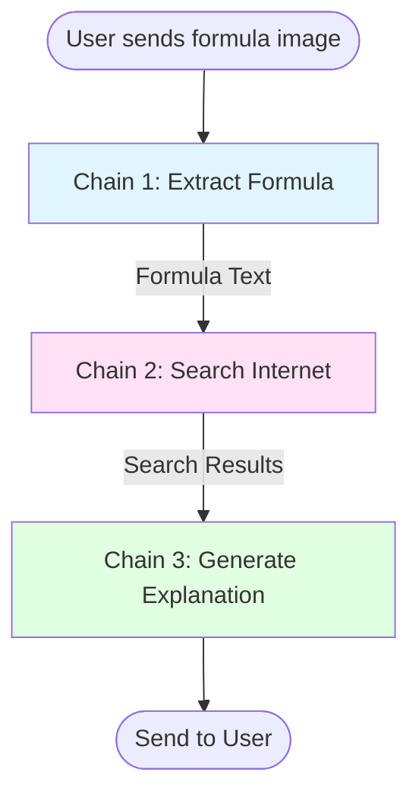

# 🔍 Simplified Plan: Internet Search Integration Only

## 🎯 Goal

Add DuckDuckGo internet search to enhance formula explanations with external data sources.

## 🔄 Simplified 3-Chain Workflow



**Chain 1**: Extract Formula (GigaChat Vision) → ~10-15s  
**Chain 2**: Search Internet (DuckDuckGo + Cache) → 2-3s  
**Chain 3**: Generate Explanation (GigaChat + Search Context) → ~10-15s

**Total**: ~25-35 seconds (or ~20-25s with cache hits)

## 📁 Files to Create

```
ainj/
└── src/
    └── services/
        └── search_service.py    # NEW: DuckDuckGo search with caching
```

## 🔧 Files to Modify

1. **requirements.txt**
   - Add: `duckduckgo-search==6.3.5`
   - Add: `langchain-community==0.3.7`

2. **src/config/settings.py**
   - Add search configuration settings

3. **src/database/models.py**
   - Add search cache table SQL

4. **src/database/repository.py**
   - Add cache get/set methods

5. **src/services/gigachat_service.py**
   - Add `search_service` parameter
   - Add `recognize_formula_with_search()` method
   - Update `_explain_formula()` to include search context

6. **src/bot/handlers/formula.py**
   - Use `recognize_formula_with_search()` instead of `recognize_formula()`

7. **src/main.py**
   - Initialize `SearchService`
   - Pass to `GigaChatService`

8. **README.md**
   - Document new search feature

## 🎨 Enhanced Response Format

```
✅ **Результат распознавания:**

📐 **Формула Эйнштейна**
E = mc²

**Область применения:** Физика (Релятивистская механика)

**Описание:**
Формула устанавливает эквивалентность массы и энергии...

**Переменные:**
• E — Энергия (Джоули)
• m — Масса (килограммы)
• c — Скорость света (≈3×10⁸ м/с)

**Практическое применение:**
- Ядерная энергетика
- Физика элементарных частиц

**Пример:**
Для массы 1 кг: E = 9×10¹⁶ Дж

---

**Источники информации:**
- 🌐 Интернет-поиск (DuckDuckGo)
- 🤖 GigaChat AI

🔗 **Дополнительные ресурсы:**
• Wikipedia: Mass–energy equivalence
• Physics Stack Exchange: Understanding E=mc²
```

## 📊 Implementation Steps

### Phase 1: Dependencies (5 min)
- Update `requirements.txt`

### Phase 2: Database & Config (15 min)
- Add cache table to `models.py`
- Add cache methods to `repository.py`
- Add settings to `settings.py`

### Phase 3: Search Service (30 min)
- Create `search_service.py`
- Implement search with caching

### Phase 4: Integration (30 min)
- Update `GigaChatService`
- Update formula handler
- Update `main.py`

### Phase 5: Testing (15 min)
- Test with sample formulas
- Verify caching works

### Phase 6: Documentation (15 min)
- Update README.md

**Total Time**: ~2 hours

## 🔑 Key Components

### 1. SearchService
```python
class SearchService:
    - search_formula(formula_text, formula_name=None)
    - get_cached_results(formula)
    - cache_results(formula, results)
    - build_search_query(formula, name)
```

### 2. Cache Database
```sql
CREATE TABLE search_cache (
    id INTEGER PRIMARY KEY,
    formula_normalized TEXT UNIQUE,
    search_query TEXT,
    results TEXT,
    created_at TIMESTAMP,
    expires_at TIMESTAMP
);
```

### 3. Configuration
```python
# .env
ENABLE_SEARCH=true
SEARCH_MAX_RESULTS=5
SEARCH_CACHE_TTL=86400  # 24 hours
```

## ✅ Success Criteria

- ✅ Internet search provides relevant results (2-3s)
- ✅ Cache reduces repeated search time (<1s)
- ✅ Explanations include search context
- ✅ Sources are properly cited
- ✅ Total response time < 35 seconds
- ✅ No breaking changes to existing functionality

## 🚀 Ready for Code Mode

All components are designed and ready for implementation. Switch to Code mode to begin!