# 🔄 Multi-Chain Workflow Diagram

## Complete Processing Flow

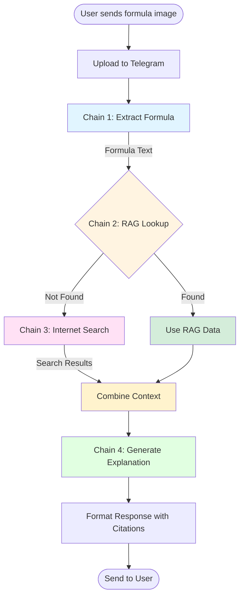

## Detailed Chain Breakdown

### Chain 1: Formula Extraction
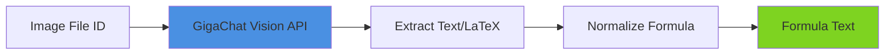

**Time**: ~10-15 seconds  
**Technology**: GigaChat Vision Model  
**Output**: Normalized formula text

---

### Chain 2: RAG Knowledge Base
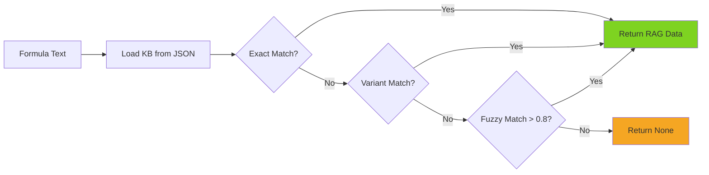

**Time**: <1 second (in-memory)  
**Technology**: Custom Python service + JSON  
**Output**: Formula metadata or None

---

### Chain 3: Internet Search
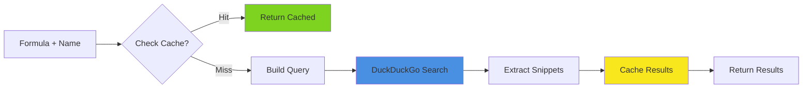

**Time**: 2-3 seconds (or <1s if cached)  
**Technology**: DuckDuckGo API + SQLite cache  
**Output**: Search results with URLs

---

### Chain 4: Comprehensive Explanation
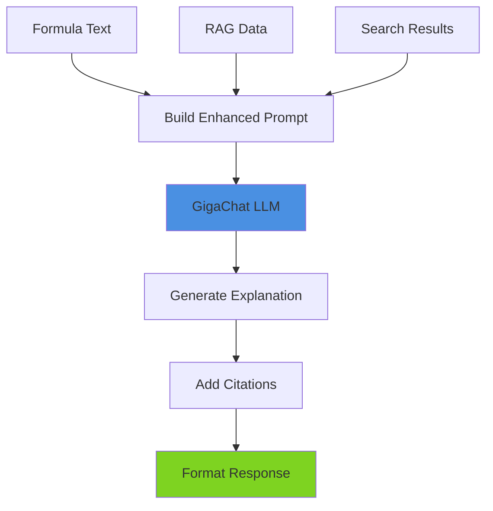

**Time**: ~10-15 seconds  
**Technology**: GigaChat + LangChain  
**Output**: Comprehensive explanation with sources

---

## Data Flow Example

### Example: E = mc²

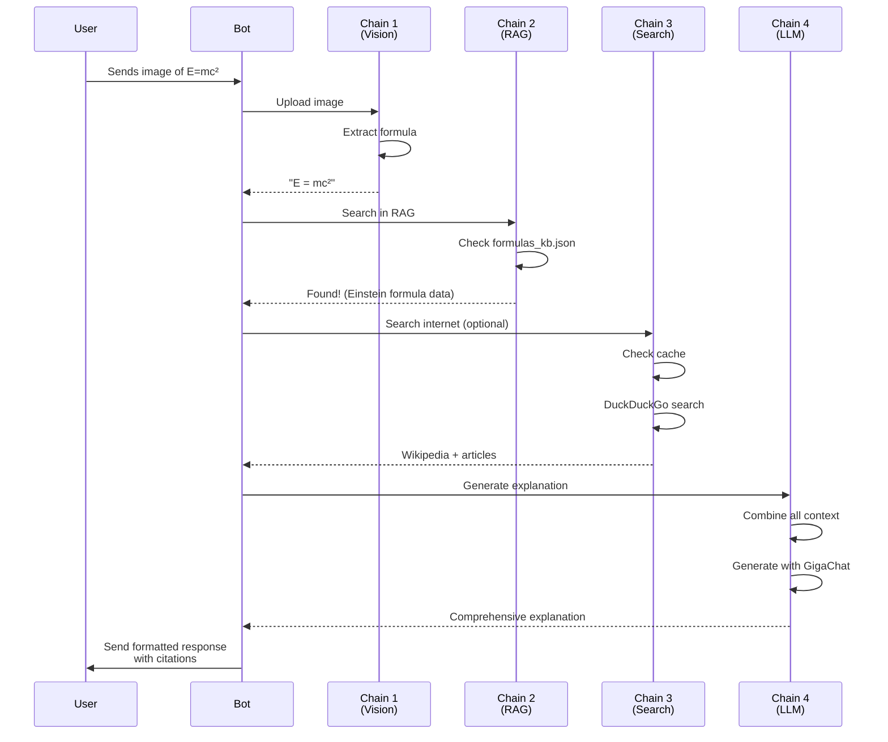

---

## Performance Optimization

### Parallel Processing
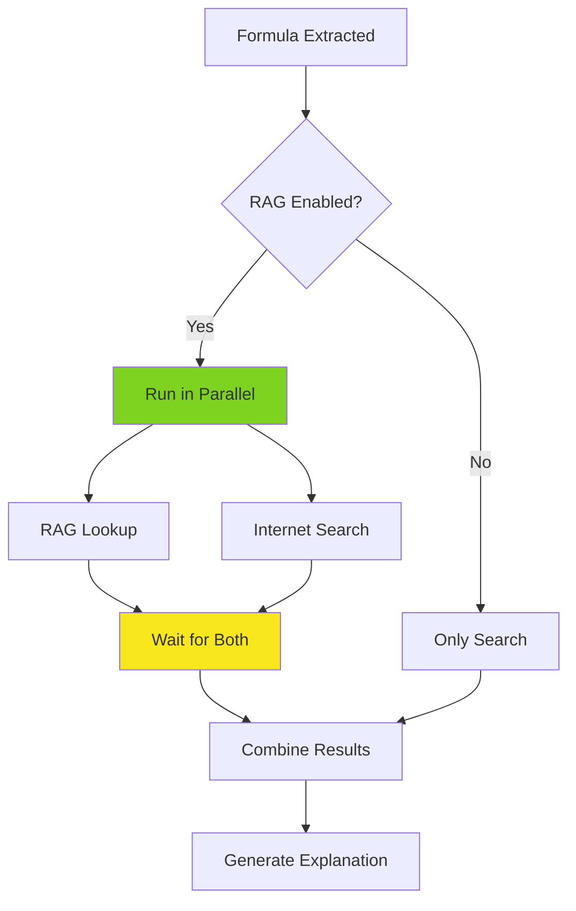

**Optimization**: Run RAG and Search concurrently using `asyncio.gather()`

---

## Error Handling Flow

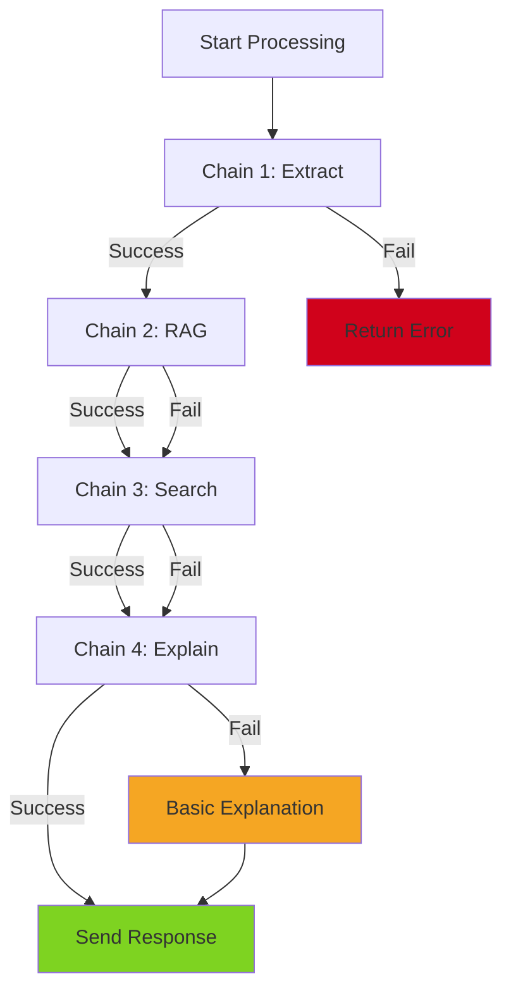

**Principle**: Always provide a response, even if some chains fail

---

## Cache Strategy

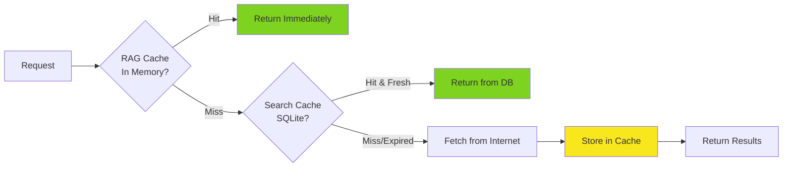

**Cache Layers**:
1. **RAG**: In-memory (permanent)
2. **Search**: SQLite (24h TTL)

---

## Response Format Structure

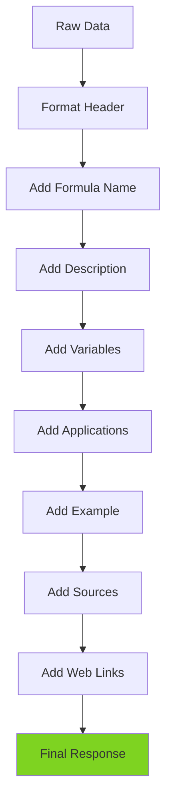

---

## System Architecture

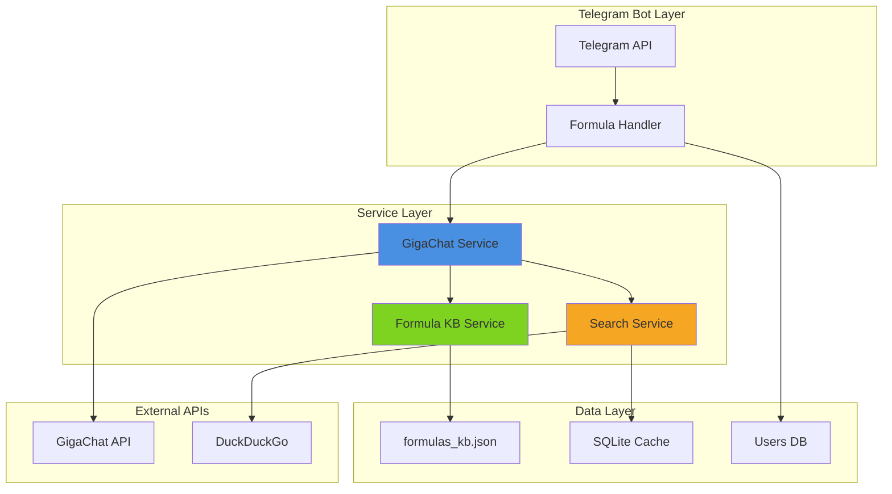

---

## Deployment Flow

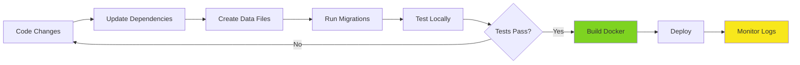

---

**Note**: All diagrams use Mermaid syntax and can be rendered in GitHub, VS Code, or any Mermaid-compatible viewer.